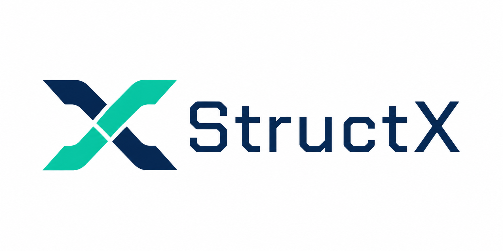
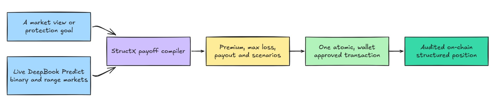
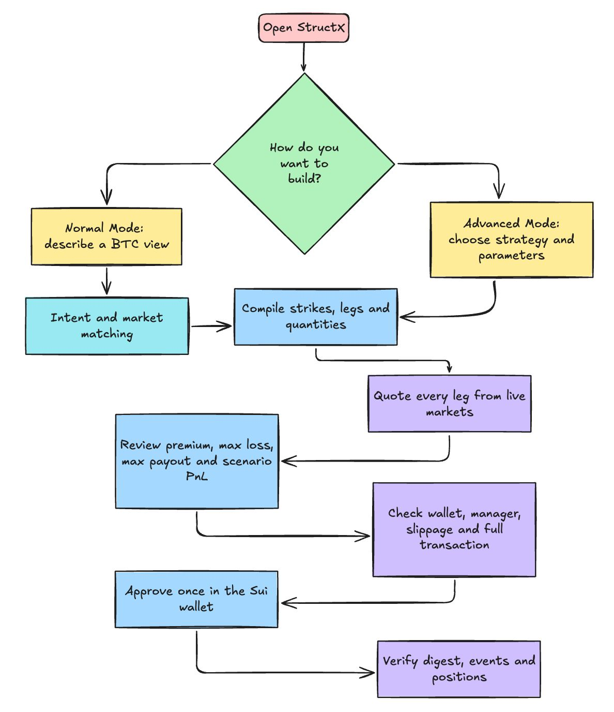
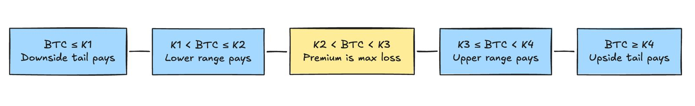
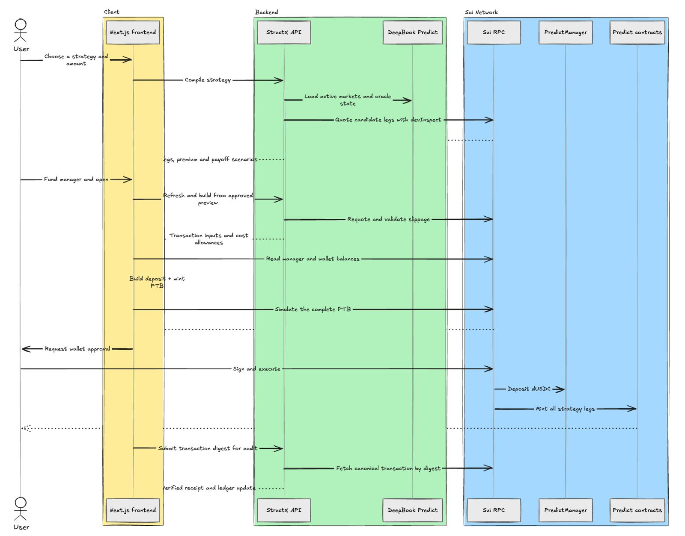
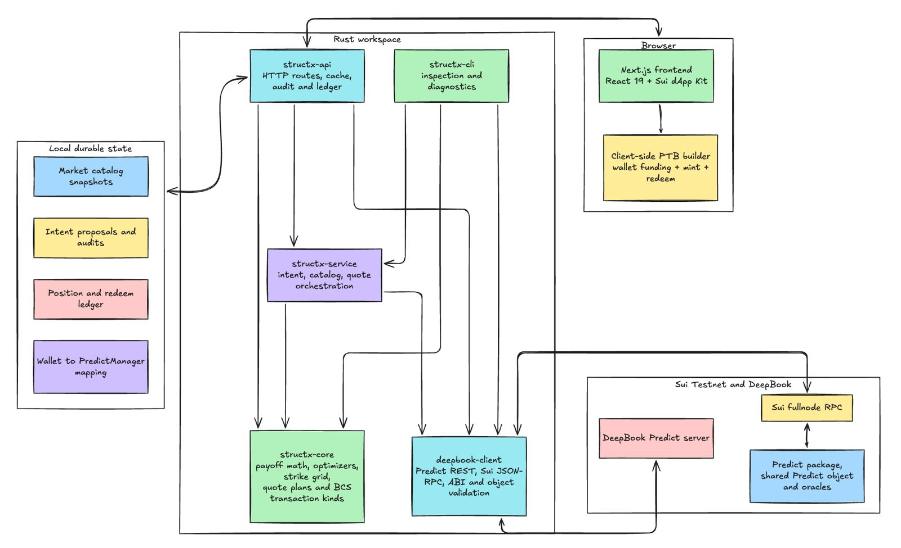

<div align="center">
  

  <h3>Turn a market view into a defined risk BTC payoff.</h3>

  <p>
    StructX is a structured payoff compiler built on <strong>DeepBook Predict</strong>.
    It combines live binary and range markets into transparent, wallet-signed strategies on Sui Testnet.
  </p>

  <p>
    
    
    
    
  </p>
</div>

---

## Table of Contents

- [The idea](#the-idea)
- [Why StructX matters](#why-structx-matters)
- [Product experience](#product-experience)
  - [Normal Mode](#normal-mode)
  - [Advanced Mode](#advanced-mode)
- [Strategy library](#strategy-library)
  - [Example: Breakout Protection](#example-breakout-protection)
- [How execution works](#how-execution-works)
- [Architecture](#architecture)
  - [Crate responsibilities](#crate-responsibilities)
  - [Frontend surfaces](#frontend-surfaces)
- [Safety model](#safety-model)
- [Transaction Hashes](#transaction-hashes)
- [Repository layout](#repository-layout)
- [Run locally](#run-locally)
  - [Prerequisites](#prerequisites)
  - [1. Clone the repository](#1-clone-the-repository)
  - [2. Start the Rust API](#2-start-the-rust-api)
  - [3. Start the frontend](#3-start-the-frontend)
  - [4. Open a strategy](#4-open-a-strategy)
- [Configuration](#configuration)
- [CLI and diagnostics](#cli-and-diagnostics)
- [Verification](#verification)
- [DeepBook integration](#deepbook-integration)
- [License](#license)

## The idea

Most prediction market interfaces begin with one question: **which outcome do you want to buy?**

StructX asks a more useful one:

> **What payoff do you want if BTC moves?**

A trader may want protection from a crash, exposure to a large move in either direction, a staged upside payout, or a position focused around a price band. Creating any of these payoffs by hand takes several steps. You have to find markets that work together, choose the strikes, size each position, check the live premiums, and prepare every contract call correctly.

StructX brings those steps into one guided flow. You describe your market view or choose a strategy, and the compiler builds a basket of DeepBook Predict positions. Together, those positions create the settlement payoff you selected.

<p align="center">
  
</p>

StructX treats prediction market positions as **financial building blocks**. One `UP`, `DOWN`, or `RANGE` position represents a single outcome. When several positions are sized and combined, they form a complete payoff curve.

## Why StructX matters

| Building manually | Building with StructX |
|---|---|
| Search individual markets and strikes | Start from the payoff or risk you care about |
| Calculate position sizes manually | Deterministic budget allocation and strike selection |
| Reason about several premiums separately | One combined premium and payoff preview |
| Submit disconnected transactions | Atomic funding and minting in one programmable transaction block |
| Reconstruct results from raw events | Verified execution receipts and a position ledger |

Our goal is to make structured products easy to understand, inspect, and combine. The strategy logic lives in Rust, the market data comes from DeepBook Predict, and the user reviews and approves the final transaction from their own wallet.

## Product experience

There are two ways to build a strategy in StructX, depending on how much control you want.

### Normal Mode

Describe your view in everyday language, then choose a budget and risk style. StructX reads the request and matches it with a live market and a suitable strategy. When `OPENAI_API_KEY` is configured, AI-assisted parsing helps understand the message. The built-in parser handles the same flow when the key is unset. Pricing, sizing, payoff construction, and transaction generation all continue through the same Rust compiler.

Example:

```text
I expect a big BTC move in either direction. Use 50 dUSDC.
```

### Advanced Mode

Choose a strategy directly and tune the controls it supports. These can include the amount, slippage allowance, strike spacing, custom bands, allocation weights, convexity, portfolio exposure, and barrier side.

Whichever path you choose, StructX takes you to the same preview and execution flow.

<p align="center">
  
</p>

## Strategy library

Each strategy has a defined maximum loss. That loss is limited to the total premium committed across its positions.

| Strategy | Market view | Structure |
|---|---|---|
| **Breakout Protection** | A large move in either direction | Downside tail, two middle ranges, upside tail |
| **Smart Budget Selector** | Let StructX compare the available structures | Scores valid candidates by payout, hit rate, worst-case improvement, complexity, budget, and style |
| **Crash Insurance** | Protect BTC-linked portfolio exposure from a deeper sell-off | Downside tail and two downside ranges, sized with an over-hedge cap |
| **Convex Tail Ladder** | Moderate moves should pay, extreme moves should pay more | Two range positions plus both binary tails |
| **Expiry Move Note** | BTC should finish meaningfully away from its current price | Four two-sided terminal-move legs |
| **Moonshot Upside** | BTC may finish above the upper band | Upper range plus upside tail |
| **Upside Step Ladder** | BTC may rise, break out, and continue higher | Near-upside range, upper range, upside tail |
| **Downside Convexity** | BTC may finish below the lower band | Lower range plus crash tail |
| **Downside Step Ladder** | BTC may drift lower, break down, and continue falling | Near-downside range, lower range, downside tail |
| **Center Band Condor** | BTC may finish near its current price | Two center ranges with smaller outside wings |
| **Near-Barrier Proxy** | BTC may finish near or beyond an upper or lower level | Near-barrier range plus a binary tail beyond the barrier |

### Example: Breakout Protection

For four ordered strikes `K1 < K2 < spot < K3 < K4`, StructX compiles:

1. A `DOWN` position at `K1` for the far downside.
2. A `RANGE` position from `K1` to `K2` for moderate downside.
3. A `RANGE` position from `K3` to `K4` for moderate upside.
4. An `UP` position at `K4` for the far upside.

The compiler quotes all four legs, allocates quantities according to the chosen style and budget, and renders the combined result across five settlement regions.

<p align="center">
  
</p>

These are **terminal-expiry** strategies. Settlement uses the final oracle price at expiry. Price movement earlier in the market window has no effect on the result.

## How execution works

The Predict mint entrypoints spend dUSDC from a shared `PredictManager`. StructX reads the dUSDC balance in both the manager and the wallet, calculates any funding shortfall with the chosen slippage allowance, and creates one atomic transaction:

1. Merge the required wallet dUSDC coin objects.
2. Split the exact funding amount.
3. Deposit that amount into the user's `PredictManager`.
4. Mint every binary and range leg.

Every step belongs to the same transaction. If a mint call fails, Sui rolls back the full transaction and the deposit returns to its original state.

<p align="center">
  
</p>

## Architecture

StructX keeps protocol access, payoff mathematics, orchestration, API state, and the user experience in focused layers. Each layer has a clear job, while the full flow remains connected from the browser to Sui.

<p align="center">
  
</p>

### Crate responsibilities

| Crate | Responsibility |
|---|---|
| [`deepbook-client`](crates/deepbook-client) | Loads Predict markets, applies freshness checks, calls Sui JSON-RPC, resolves object references, and verifies the expected Predict ABI. |
| [`structx-core`](crates/structx-core) | Pure payoff compilation, price scaling, strike grids, strategy optimizers, quote guards, scenario tables, and Sui transaction-kind construction. |
| [`structx-service`](crates/structx-service) | Selects candidate markets, compiles against live quotes, plans natural-language intent, maintains the market catalog, and assembles proposal responses. |
| [`structx-api`](crates/structx-api) | Exposes HTTP endpoints, caches compiled plans, builds open requests, verifies chain transactions, stores audits, and maintains the canonical position ledger. |
| [`structx-cli`](crates/structx-cli) | Provides low-level market inspection, ABI verification, manager diagnostics, quote simulation, mint checks, and redeem debugging. |

### Frontend surfaces

| Route | Purpose |
|---|---|
| `/` | Product story and entry point |
| `/strategies` | Normal Mode intent flow and Advanced Mode strategy library |
| `/strategies/[id]` | Live strategy workbench, preview, funding, execution, and receipt |
| `/markets` | DeepBook Predict market directory and expiry status |
| `/positions` | Open and closed positions, live close estimates, redeem flow, and chain sync |
| `/app` | Original full workspace used for diagnostics and comparison |

## Safety model

The interface shows the important transaction details before the wallet opens. This gives the user a clear view of the cost, the positions being created, and the transaction they are about to approve.

- **Defined loss:** strategy loss is capped by the premium shown in the preview.
- **Live requoting:** every build refreshes market data and rejects prices outside the approved slippage limit.
- **Atomic funding:** wallet dUSDC funding and all mint calls execute in one PTB.
- **Full simulation:** the frontend simulates the exact deposit-and-mint transaction before wallet approval.
- **Wallet authority:** the connected wallet sets the sender and approves the final transaction.
- **Canonical audit:** the backend fetches the transaction by digest directly from Sui and uses the chain response as the source of truth.
- **Object validation:** shared object ownership, versions, types, and Predict ABI shapes are checked before transaction construction.
- **Freshness rules:** stale price, SVI, and expiry data are filtered before market selection.
- **Durable records:** proposals, audits, redemptions, market snapshots, and positions are stored with atomic writes and safe path handling.

## Transaction Hashes

`Normal Mode : ` https://testnet.suivision.xyz/txblock/2v7X7TKDyGqAcPSNPTQTFdh3QkHADXEf7TVsrAiLkokf

`Advanced Mode: ` https://testnet.suivision.xyz/txblock/EsTe9VFgSHrm4rsYgBigwVtTpCFGUVqF5rxL54WRBpb4


## Repository layout

```text
StructX/
├── assets/
│   └── structx-logo.png
├── crates/
│   ├── deepbook-client/
│   ├── structx-core/
│   ├── structx-service/
│   ├── structx-api/
│   └── structx-cli/
├── frontend/
│   ├── public/
│   └── src/
│       ├── app/
│       ├── components/
│       ├── lib/
│       └── types/
├── Cargo.toml
└── README.md
```

## Run locally

### Prerequisites

- Rust and Cargo
- Node.js 20.9 or newer
- A Sui wallet supported by `@mysten/dapp-kit`
- Sui Testnet SUI for gas
- Testnet dUSDC for strategy premiums

### 1. Clone the repository

```bash
git clone https://github.com/WhiteFlash14/StructX.git
cd StructX
```

### 2. Start the Rust API

```bash
cargo run -p structx-api
```

The API listens on `http://127.0.0.1:8787` by default.

### 3. Start the frontend

Open a second terminal:

```bash
cd frontend/
npm ci
npm run dev
```

Open [http://localhost:3000](http://localhost:3000), connect a Sui Testnet wallet, and choose a strategy.

### 4. Open a strategy

1. Connect the wallet and switch it to Sui Testnet.
2. Let StructX find or create the wallet's `PredictManager`.
3. Enter an amount and select **Preview payoff**.
4. Review the premium, max loss, positions, and settlement scenarios.
5. Select **Fund manager and open**.
6. Review the transaction in the wallet and approve it.
7. Inspect the verified receipt or open the new position from `/positions`.

## Configuration

All variables are optional for the default local Testnet setup.

| Variable | Default | Purpose |
|---|---|---|
| `NEXT_PUBLIC_STRUCTX_API_BASE` | `http://127.0.0.1:8787` | Frontend API base URL |
| `STRUCTX_API_ADDR` | `127.0.0.1:8787` | API bind address |
| `STRUCTX_ALLOWED_ORIGINS` | `http://localhost:3000,http://127.0.0.1:3000` | Comma-separated browser origins allowed by CORS |
| `STRUCTX_RPC_URL` | Sui Testnet fullnode | RPC used for quoting and object resolution |
| `STRUCTX_PREDICT_SERVER_URL` | DeepBook Predict Testnet server | Predict market-data endpoint |
| `STRUCTX_PREDICT_ID` | Current Testnet Predict object | Override the shared Predict object |
| `STRUCTX_STATE_DIR` | `artifacts/structx_state` | Durable market, proposal, audit, and position state |
| `STRUCTX_MANAGERS_PATH` | `data/managers.json`, or `<STRUCTX_STATE_DIR>/managers.json` when the state directory is set | Optional wallet-to-manager store override |
| `OPENAI_API_KEY` | unset | Enables structured AI interpretation in the guided intent parser |
| `OPENAI_MODEL` | `gpt-4o-mini` | Model used when AI intent parsing is enabled |

Example:

```bash
export STRUCTX_ALLOWED_ORIGINS="http://localhost:3000"
export STRUCTX_STATE_DIR="./artifacts/structx_state"
cargo run -p structx-api
```

## CLI and diagnostics

The CLI exposes the same lower-level capabilities used while developing the product:

```bash
cargo run -p structx-cli -- --help
cargo run -p structx-cli -- list-markets
cargo run -p structx-cli -- verify-abi
```

Useful commands include market selection, JSON strategy compilation, quote and mint `devInspect`, manager balance reads, position reads, ABI checks, execution audits, and redeem diagnostics.

## Verification

```bash
# Rust tests
cargo test --workspace

# Rust static analysis
cargo clippy --workspace --all-targets -- -D warnings

# Frontend type check and production build
cd tp-main/frontend
npx tsc --noEmit
npm run build
```

Together, these checks cover payoff compilation, strategy allocation, market freshness, market selection, quote guards, transaction construction, storage safety, intent parsing, execution audits, and position-ledger accounting.

## DeepBook integration

StructX builds a product layer on top of DeepBook Predict. DeepBook handles the market infrastructure, while StructX turns its position primitives into guided multi-leg strategies.

DeepBook Predict provides:

- Live oracle-driven expiry markets
- Binary and range position primitives
- Quote and mint entrypoints
- Shared Predict and `PredictManager` objects
- Settlement and redemption mechanics

StructX adds:

- Goal-to-strategy discovery
- Multi-leg payoff compilation
- Budget-aware position sizing
- Strike-grid selection and live requoting
- Human-readable payoff visualization
- Atomic wallet funding and execution
- Canonical execution audits and portfolio tracking

This relationship sits at the heart of the product: **DeepBook supplies composable outcome liquidity, and StructX turns that liquidity into financial products people can understand and use.**

## License

The Rust workspace is declared under the MIT license.

---

<div align="center">
  <strong>StructX</strong><br/>
  Build the payoff you mean.
</div>
